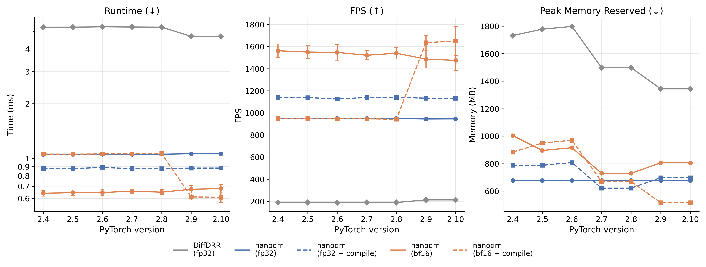

# nanodrr

A performance-oriented reimplementation of [`DiffDRR`](https://github.com/eigenvivek/DiffDRR) with the following improvements:

- Optimized, pure PyTorch implementation (**~5× faster than `DiffDRR` at baseline**)
- Modular design (freely swap subjects, extrinsics, and intrinsics during rendering)
- Compatibility with `torch.compile` and mixed precision
- Extensive type hints with `jaxtyping`
- Standard Python package structure managed with `uv`

All projective geometry is implemented internally using the standard [Hartley and Zisserman](https://www.cambridge.org/core/books/multiple-view-geometry-in-computer-vision/0B6F289C78B2B23F596CAA76D3D43F7A) pinhole camera formulation.

## Installation

> [!NOTE]
>
> On `pytorch<2.9`, `torch.compile` with `bfloat16` is slower than eager due to a CUDA graph capture issue (see [Benchmarks](#benchmarks)). Use `pytorch>=2.9` (Triton ≥3.5) for best results.

```
pip install "git+https://github.com/eigenvivek/nanodrr.git"
```

## Benchmarks

> [!IMPORTANT]
> - **~5× faster** than [`DiffDRR`](https://github.com/eigenvivek/DiffDRR) out of the box, without compilation (946 FPS vs 213 FPS)
> - **~8× faster** with `torch.compile` and `bfloat16` on `pytorch>=2.9` (1,650 FPS vs 213 FPS)
> - **~2.5× less memory** than `DiffDRR` (516 MB vs 1,344 MB peak reserved with `bfloat16` + compile)



> *Mean ± std. dev. of 10 runs, 100 loops each. Benchmarked by rendering 200×200 DRRs on an NVIDIA RTX 6000 Ada (48 GB) with Python 3.12. Compile represents `torch.compile(mode="reduce-overhead", fullgraph=True)`. Full experiment at [`tests/benchmark/`](tests/benchmark/).*

## Roadmap

- [x] Implement a fully optimized renderer
- [x] Port strictly necessary modules from `DiffDRR` (e.g., SE(3) utilities, loss functions, and 2D plotting)
- [x] Migrate 3D plotting functions to an optional module
- [ ] Integrate with [`xvr`](https://github.com/eigenvivek/xvr) to speed up network training and registration
- [ ] Integrate with [`polypose`](https://github.com/eigenvivek/polypose) to speed up registration
- [ ] Release as `v1.0.0` of `DiffDRR`!
